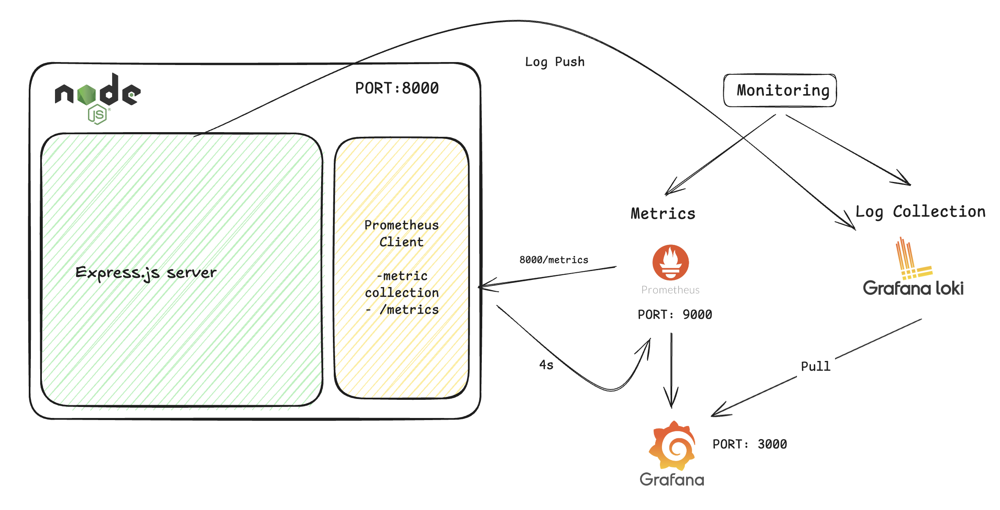
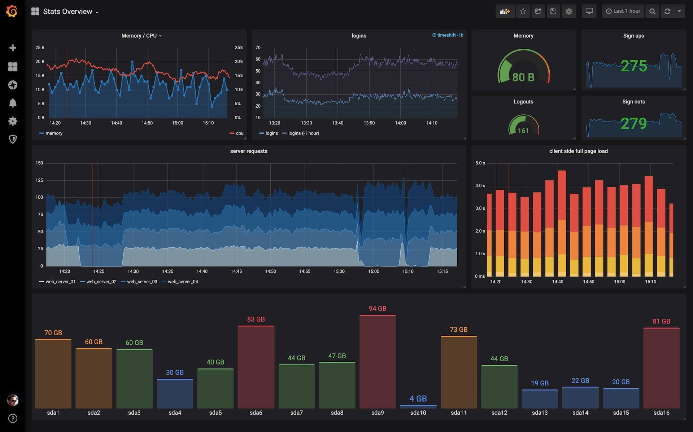

# 📊 Monitoring with Grafana, Loki and Prometheus

> **Complete observability stack setup guide**

🎥 **Video Tutorial:** [Watch on YouTube](https://youtu.be/ddZjhv66o_o)



---

## 📋 Prerequisites

Before you begin, ensure you have:

- ✅ Basic knowledge of **Node.js** and **Express Framework**
- ✅ Basic to intermediate knowledge in **Docker** and **Containerization**
  - 📚 [Learn Docker Containerization](https://docs.docker.com/get-started/)

---

## 🚀 Installation and Setup

### 1️⃣ Prometheus Server

#### Create Configuration File

Create a `prometheus.yml` file with the following configuration:

> ⚠️ **Important:** Replace `<NODEJS_SERVER_ADDRESS>` with your actual Node.js server address (e.g., `localhost:8000` or `node-app:8000`)

```yaml
global:
  scrape_interval: 4s

scrape_configs:
  - job_name: prometheus
    static_configs:
      - targets: ["<NODEJS_SERVER_ADDRESS>"]
```

**Example:**

```yaml
global:
  scrape_interval: 4s

scrape_configs:
  - job_name: prometheus
    static_configs:
      - targets: ["localhost:8000"]
```

---

#### Start Prometheus Server

Create a `docker-compose.yml` file:

```yaml
version: "3"

services:
  prom-server:
    image: prom/prometheus
    ports:
      - 9090:9090
    volumes:
      - ./prometheus.yml:/etc/prometheus/prometheus.yml
```

**Run Prometheus:**

```bash
docker-compose up -d
```

✅ **Prometheus server is now running at:** [http://localhost:9090](http://localhost:9090)

---

### 2️⃣ Setup Grafana

Run Grafana using Docker:

```bash
docker run -d -p 3000:3000 --name=grafana grafana/grafana-oss
```

✅ **Grafana is now running at:** [http://localhost:3000](http://localhost:3000)

**Default credentials:**

- Username: `admin`
- Password: `admin`

> 📝 You'll be prompted to change the password on first login
>
> 

---

### 3️⃣ Setup Loki Server

Run Loki using Docker:

```bash
docker run -d --name=loki -p 3100:3100 grafana/loki
```

✅ **Loki is now running at:** [http://localhost:3100](http://localhost:3100)

---

## 🌐 Service Overview

| Service              | Port | URL                                         | Default Credentials |
| -------------------- | ---- | ------------------------------------------- | ------------------- |
| **Prometheus** | 9090 | [http://localhost:9090](http://localhost:9090) | -                   |
| **Grafana**    | 3000 | [http://localhost:3000](http://localhost:3000) | `admin / admin`   |
| **Loki**       | 3100 | [http://localhost:3100](http://localhost:3100) | -                   |

---

## 🔗 Connect Services in Grafana

### Add Prometheus Datasource

1. Open Grafana: [http://localhost:3000](http://localhost:3000)
2. Navigate to **Configuration** → **Data Sources**
3. Click **Add data source**
4. Select **Prometheus**
5. Configure:
   - **URL:** `http://localhost:9090`
   - Click **Save & Test**

---

### Add Loki Datasource

1. Navigate to **Configuration** → **Data Sources**
2. Click **Add data source**
3. Select **Loki**
4. Configure:
   - **URL:** `http://localhost:3100`
   - Click **Save & Test**

---

## 🐳 Complete Docker Compose (All Services)

For easier management, combine all services in one `docker-compose.yml`:

```yaml
version: "3.8"

services:
  # Prometheus
  prometheus:
    image: prom/prometheus:latest
    container_name: prometheus
    ports:
      - "9090:9090"
    volumes:
      - ./prometheus.yml:/etc/prometheus/prometheus.yml
    command:
      - '--config.file=/etc/prometheus/prometheus.yml'
    networks:
      - monitoring

  # Grafana
  grafana:
    image: grafana/grafana-oss:latest
    container_name: grafana
    ports:
      - "3000:3000"
    environment:
      - GF_SECURITY_ADMIN_PASSWORD=admin
    networks:
      - monitoring

  # Loki
  loki:
    image: grafana/loki:latest
    container_name: loki
    ports:
      - "3100:3100"
    command: -config.file=/etc/loki/local-config.yaml
    networks:
      - monitoring

  # Your Node.js App (example)
  node-app:
    build: ./app
    container_name: node-app
    ports:
      - "8000:8000"
    networks:
      - monitoring

networks:
  monitoring:
    driver: bridge
```

**Run all services:**

```bash
docker-compose up -d
```

**Stop all services:**

```bash
docker-compose down
```

---

## ✅ Verify Setup

### Check Prometheus Targets

1. Open [http://localhost:9090/targets](http://localhost:9090/targets)
2. Verify your Node.js app target shows **UP** (green)

---

### Test Metrics Endpoint

```bash
curl http://localhost:8000/metrics
```

**Expected output:**

```
# HELP process_cpu_user_seconds_total Total user CPU time spent in seconds.
# TYPE process_cpu_user_seconds_total counter
process_cpu_user_seconds_total 0.123
...
```

---

## 🔍 Next Steps

1. **Create Dashboards** in Grafana
2. **Set up Alerts** for critical metrics
3. **Configure Log Shipping** to Loki
4. **Import Pre-built Dashboards** from [Grafana Dashboard Gallery](https://grafana.com/grafana/dashboards/)

---

## 📚 Additional Resources

- 📘 [Prometheus Documentation](https://prometheus.io/docs/)
- 📗 [Grafana Documentation](https://grafana.com/docs/)
- 📙 [Loki Documentation](https://grafana.com/docs/loki/latest/)
- 🎥 [Video Tutorial](https://youtu.be/ddZjhv66o_o)

---

## 🐛 Troubleshooting

### Prometheus can't reach Node.js app

**Problem:** Target shows **DOWN** in Prometheus

**Solutions:**

1. Check if Node.js app is running: `curl http://localhost:8000/metrics`
2. If using Docker Compose, use service name instead of `localhost`:

```yaml
   targets: ["node-app:8000"]
```

3. Ensure all services are on the same Docker network

---

### Grafana can't connect to Prometheus/Loki

**Problem:** "Connection refused" error

**Solutions:**

1. Use container names if in same Docker network: `http://prometheus:9090`
2. Use `host.docker.internal` on Mac/Windows: `http://host.docker.internal:9090`
3. Check service logs: `docker logs grafana`

---

### No metrics appearing

**Problem:** Grafana shows "No data"

**Solutions:**

1. Verify Prometheus is scraping: Check `/targets` page
2. Check metric names in Prometheus: [http://localhost:9090/graph](http://localhost:9090/graph)
3. Verify query syntax in Grafana

---

## 🎯 Quick Commands Reference

```bash
# Start all services
docker-compose up -d

# View logs
docker-compose logs -f

# Stop all services
docker-compose down

# Restart specific service
docker-compose restart prometheus

# Check service status
docker-compose ps
```

---

<div align="center">

**Happy Monitoring! 📊**

If you found this helpful, ⭐ star the repository!

</div>
