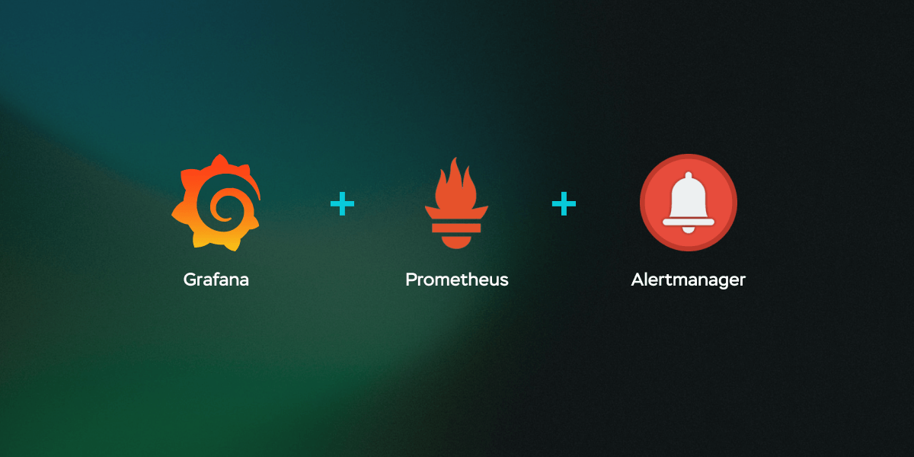

# Grafana & Prometheus — Hands-on Exercises

This repository contains **hands-on demos, plugins, and sample applications** used to learn **Prometheus monitoring** and **Grafana visualization**, ranging from basic Docker setups to advanced AI-powered plugins.

---

## 📘 Notes

* 📄 [Read Notes](Prometheus%20&%20Grafana%20—%20Core%20Concepts.md)

---

## ⚙️ Prerequisites & Installation

To run the exercises, ensure the following tools are installed:

* 🐳 **Docker**
  [https://docs.docker.com/engine/install/](https://docs.docker.com/engine/install/)

* 🌍 **Terraform**
  [https://developer.hashicorp.com/terraform/tutorials/aws-get-started/install-cli](https://developer.hashicorp.com/terraform/tutorials/aws-get-started/install-cli)

* 🟢 **Node.js (with npm)**
  [https://nodejs.org/en/download](https://nodejs.org/en/download)

* 🐍 **Python**
  [https://www.python.org/downloads/](https://www.python.org/downloads/)

---

## 📥 Setup Instructions

1. Clone this repository to your local machine using:

   * Terminal (macOS / Linux)
   * Command Prompt / PowerShell (Windows)
   * GUI tools (e.g., SourceTree)

2. Navigate to the project root before running examples.

---

## ▶️ Running the Examples

Each demo environment lives in its own folder. Advanced examples include dedicated README files with step-by-step instructions.

> 💡 **Tip:** Follow along with the course videos for best understanding.

---

### 🐳 Simple Docker Playground

A minimal environment to explore Prometheus and Grafana using Docker Compose.

* 📁 Location: `docker/`

```bash
cd docker
docker-compose up -d && docker-compose logs -f

# Required Commands

docker restart grafana       # reuse grafana
docker restart prometheus    # restart prometheus
docker rm -f grafana         # remove conflicting container
docker-compose up -d         # recreate containers

```

---

### 🔌 Basic Grafana Plugin Example

A simple plugin generated using the **Grafana Plugin Scaffold**.

* 📁 Location: `plugin-example/test-test-datasource/`
* 📘 Setup Guide:
  plugin-example/test-test-datasource/README.md

---

### 🛒 Ecommerce Application (Dashboard Building)

A sample **order management system** used to build **production-grade Grafana dashboards**.

* 📁 Location: `ecommerce-application/`
* 📘 Setup Guide:
  ecommerce-application/README.md

---

### 🤖 LLM Plugin Demo

An advanced example showing how to integrate **Large Language Models (LLMs)** with **Grafana Open Source**.

* Demonstrates AI-assisted insights and workflows
* 📁 Location: `llm-plugin-demo/`
* 📘 Setup Guide:
  llm-plugin-demo/README.md

---

## 🎯 Learning Outcomes

By completing these exercises, you will be able to:

* Set up Prometheus & Grafana using Docker
* Build and customize Grafana dashboards
* Develop and test Grafana plugins
* Monitor real-world applications
* Explore AI/LLM integrations with observability tools
